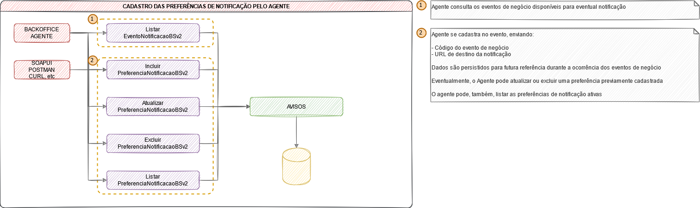
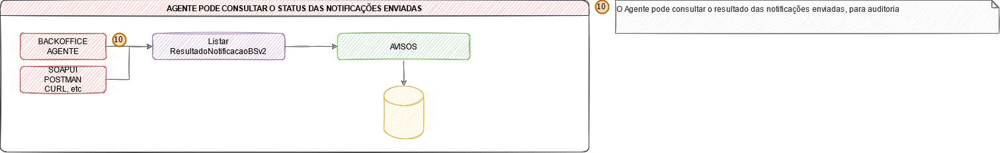

# Webhook da Plataforma de Integração CCEE - Notificação de eventos de negócio

## A Plataforma de Integração CCEE

A [Plataforma de Integração](https://www.ccee.org.br/portal/faces/oquefazemos_menu_lateral/plataforma_integracao?_adf.ctrl-state=ie2aj4g26_1&_afrLoop=94106078621418#!%40%40%3F_afrLoop%3D94106078621418%26_adf.ctrl-state%3Die2aj4g26_5) é uma ferramenta que conecta os sistemas dos agentes com os sistemas da CCEE.

A solução complementa os canais de acesso oferecidos pela CCEE para conectar o negócio do cliente de forma simples e acessar informações com rapidez, segurança e confiabilidade.

Entre os benefícios para os agentes que utilizam a plataforma estão:
- Redução de atividades manuais por meio da integração entre sistemas
- Menor custo e risco operacional com a automatização de rotinas
- Maior agilidade e qualidade na integração e no intercâmbio de dados entre CCEE e demais participantes do mercado

### Quem pode utilizar

Agentes e consultorias que tenham representação total dos seus clientes aderidos à CCEE.

> Para saber mais sobre a Plataforma de Integração, acesse [clique aqui](../postman-collections)

### Como aderir

Para utilizar a solução, basta possuir um certificado digital e realizar um cadastro na CCEE. Veja como é simples:
1. [Adquira um certificado digital](https://www.iti.gov.br/index.php/icp-brasil/estrutura)
2. [Cadastre-se na Plataforma de Integração da CCEE](https://www.ccee.org.br/cs/idcplg?IdcService=GET_FILE&dDocName=CCEE_650001&RevisionSelectionMethod=LatestReleased&allowInterrupt=1&noSaveAs=1)

Para isso, o participante de mercado deve cadastrar-se para receber tais notificações em uma interface API que tenha previamente preparado para tratar tais notificações.

## Receba eventos de notificação através do webhook da Plataforma de Integração

Ao realizar a integração entre sua aplicação e a CCEE através da Plataforma de Integração, o agente pode registrar contratos, listar montantes de energia, obter dados de um ponto de medição ou listar medidas consolidadas, entre outras funcionalidades. E, entre as mudanças de estado das entidades, como a validação de um contrato ou o ajuste de um montante, a CCEE pode enviar notificações para os sistemas dos agentes.

## O que é o webhook?

O webhook da Plataforma de Integração é uma funcionalidade que envia notificações de evento negócio para as aplicações dos agentes que, previamente, tenham se cadastrado para recebe-las. Na prática, é uma maneira de a CCEE estimular a aplicação do agente, a partir de um evento de negócio relevante ter sido gerado por uma aplicação interna da CCEE.

## Visão geral


### Conceitos importantes

- **Entidade** - Objeto que indica uma entidade de negócio, para a qual um ou mais eventos podem ser associados. Preferencialmente, deve-se utilizar um **substantivo**, sem espaços, acentuações ou caracteres especiais, seguindo o conceito de enumeration.

	> **Exemplos**
	>  - CONTRATO
	>  - MONTANTE_ENERGIA

- **Evento de negócio** - Objeto que indica uma ação que já se encontra realizada em relação a uma entidade. Preferencialmente, deve-se utilizar um **verbo no particípio**, regular ou irregular, sem espaços, acentuações ou caracteres especiais, seguindo o conceito de enumeration.

	> **Exemplos**
	> - REGISTRADO
	> - VALIDADO
	> - FINALIZADO
	> - AJUSTADO

- **Código do evento de notificação** - Identifica a relação "*entidade*" + "*evento de negócio*", e será o código utilizado pelo agente para cadastro das preferências, recebimento das notificações e consulta dos resultados. O valor é formado pelo **nome da entidade** e pelo **nome do evento de negócio**, separados por um ponto (".").

	> **Exemplos**
	> - CONTRATO.REGISTRADO
	> - CONTRATO.VALIDADO
	> - MONTANTE_ENERGIA.AJUSTADO

- **Endereço de destino** - Endereço para o qual o agente deseja que as notificações sejam enviadas. Esta informação é armazenada no AVISOS.

	> **Exemplos**
	> - https://url_do_agente/preferencia1
	> - https://url_do_agente/preferencia2
	> - https://url_do_agente/preferencia3


## O que fazer para utilizar o webhook?


---

### Implemente endpoint para receber notificações


Implemente uma interface RestAPI que irá receber as notificações de um ou mais eventos de negócio.

- Interface exposta em HTTP/HTTPS
- Ao receber a notificação, deve-se retornar o HTTP response code = 201 para a CCEE
- Caso outro código seja retornado, a CCEE irá reenviar a notificação a cada 5 minutos, por um prazo de 24 horas ou até que a interface do participante de mercado retorne o código 201 (o que acontece primeiro)

Os exemplos abaixo contêm sugestões de implantação da interface RestAPI no servidor do participante de mercado

- [Swagger](./exemplos/webhook.json) 
- [YAML](./exemplos/webhook.yaml) 

```json
{
	"eventoNotificacao": "CONTRATO.REGISTRADO",
	"metadados": [
		{
			"nome": "ID_CONTRATO",
			"valor": "1234"
		},
		{
			"nome": "DATA_ORIGEM_EVENTO",
			"valor": "2021-05-11T05:30:00.000Z"
		},
		{
			"nome": "MES_REFERENCIA",
			"valor": "null"
		},
		{
			"nome": "AMBIENTE_CONTRATACAO",
			"valor": "ACL"
		}
	],
	"transactionId": "12345678-1234-1234-1234-123465789012"
}
```

---

### Liste os eventos de notificação disponíveis


Utilize o serviço *ListarEventoNotificacaoBSv2* para obter a lista de eventos de notificação disponíveis para subscrição. O resultado desse serviço deve ser considerado para o cadastro das preferências de notificação, ou seja, para indicar para quais eventos o participante de mercado deseja receber notificações, e em qual URL de API.

> Clique no botão abaixo e abra a configuração direto no Postman instalado em seu computador com os serviços da Plataforma de Integração, incluindo o *ListarEventoNotificacaoBSv2*
> 
> [](https://app.getpostman.com/run-collection/27dc730daa9ea47cfa3e)

---

### Faça a subscrição nos eventos desejados


Realize a subscrição nos eventos de negócio de seu interesse, informando o código do evento e para qual URL a notificação será enviada. A URL deve ser previamente configurada pelo participante de mercado, conforme descrito no processo 1. A subscrição deve ser feita através dos serviços:

- *IncluirPreferenciaNotificacaoBSv2*
- *AtualizarPreferenciaNotificacaoBSv2*
- *ExcluirPreferenciaNotificacaoBSv2*
- *ListarPreferenciaNotificacaoBSv2*

> Clique no botão abaixo e abra a configuração direto no Postman instalado em seu computador com os serviços da Plataforma de Integração, incluindo a lista de serviços acima
> 
> [](https://app.getpostman.com/run-collection/27dc730daa9ea47cfa3e)



---

### Receba e processe as notificações enviadas pela CCEE


Ao se subscrever em um evento de notificação, o participante de mercado passa a ser elegível para receber as mensagens de notificações daquele evento, que serão geradas pelos sistemas da CCEE. Lembre de criar a interface sugerida no processo 1:

Os exemplos abaixo contêm sugestões de implantação da interface RestAPI no servidor do participante de mercado

- [Swagger](./exemplos/webhook.json) 
- [YAML](./exemplos/webhook.yaml) 

```json
{
	"eventoNotificacao": "CONTRATO.REGISTRADO",
	"metadados": [
		{
			"nome": "ID_CONTRATO",
			"valor": "1234"
		},
		{
			"nome": "DATA_ORIGEM_EVENTO",
			"valor": "2021-05-11T05:30:00.000Z"
		},
		{
			"nome": "MES_REFERENCIA",
			"valor": "null"
		},
		{
			"nome": "AMBIENTE_CONTRATACAO",
			"valor": "ACL"
		}
	],
	"transactionId": "12345678-1234-1234-1234-123465789012"
}
```


---

### Consulte o status de notificações enviadas


Se desejado, é possível que o participante de mercado consulte o status de notificações enviadas. Á consulta está disponível através do serviço *ListarResultadoNotificacaoBSv2*

> Clique no botão abaixo e abra a configuração direto no Postman instalado em seu computador com os serviços da Plataforma de Integração, incluindo o *ListarResultadoNotificacaoBSv2*
> 
> [](https://app.getpostman.com/run-collection/27dc730daa9ea47cfa3e)



# Referências

- [Autenticação](https://www.ccee.org.br/cs/idcplg?IdcService=GET_FILE&dDocName=CCEE_316820&RevisionSelectionMethod=LatestReleased&allowInterrupt=1&noSaveAs=1)
- [Guia de contratos](https://www.ccee.org.br/cs/idcplg?IdcService=GET_FILE&dDocName=CCEE_650000&RevisionSelectionMethod=LatestReleased&allowInterrupt=1&noSaveAs=1)
- [Manual de uso dos serviços de acrônimos](https://www.ccee.org.br/cs/idcplg?IdcService=GET_FILE&dDocName=CCEE_654103&RevisionSelectionMethod=LatestReleased&allowInterrupt=1&noSaveAs=1)
- [Manual do usuário da plataforma de integração - Alertas e exceções](https://www.ccee.org.br/cs/idcplg?IdcService=GET_FILE&dDocName=CCEE_654104&RevisionSelectionMethod=LatestReleased&allowInterrupt=1&noSaveAs=1)
- [Manual de uso dos serviços de relatórios e resultados](https://www.ccee.org.br/cs/idcplg?IdcService=GET_FILE&dDocName=CCEE_655694&RevisionSelectionMethod=LatestReleased&allowInterrupt=1&noSaveAs=1)
- [Manual de uso dos serviços de PLD](https://www.ccee.org.br/cs/idcplg?IdcService=GET_FILE&dDocName=CCEE_656669&RevisionSelectionMethod=LatestReleased&allowInterrupt=1&noSaveAs=1)

- [Postman Learning Center](https://learning.postman.com/)
- [Postman - Working with certificates](https://learning.postman.com/docs/sending-requests/certificates/)
